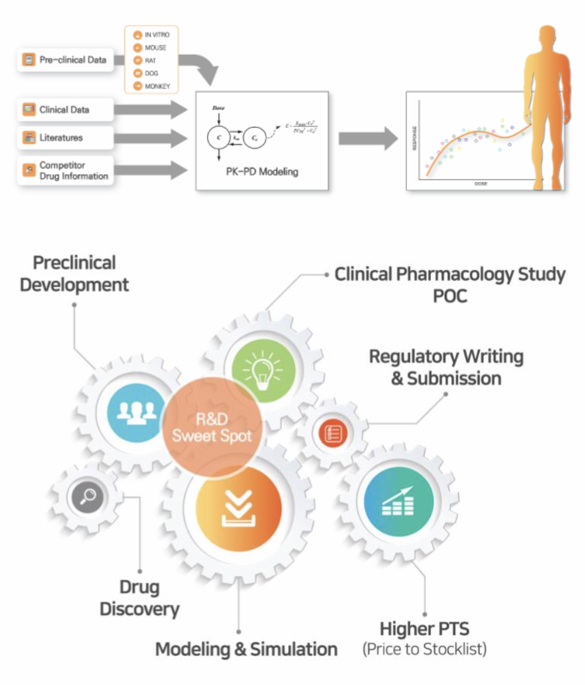

# Introduction 

## Memorandum

**서울성모병원 임상약리과 - 가톨릭대학교 계량약리학연구소 (PIPET)**

### Trainee

1. 모르는 것을 끝까지 파고드는 호기심이 명문대 졸업장을 이긴다. (졸업장, 면허증 하나로 편히 살려는 사람 사절)
2. 학문에 있어서는 계급장 떼고 토론하라. (上命下服과 science는 함께할 수 없다.)
3. 모르는 것은 모른다고 말하라. (모름을 숨기면 배울 기회를 차버리는 것이다.)
4. 배우고 난 후 생각하고 질문하지 않는다면 배운 것이 아니다. (남이 지식을 전달해 줄 수 있어도 생각까지 대신해 줄 수는 없다.)
5. 사람의 품성은 아랫사람을 대하는 태도에서 거짓없이 드러난다. (위만 쳐다보지 말고 주변이 함께 일하고 싶은 사람이 되기를)

### Faculty

1. 속도보다 방향이다.
2. 윗사람에게 무조건 순종하거나 비위 맞추는 사람을 교수로 들이지 말라. (아래에도 같은 것을 요구하여 대학을 망친다.)
3. 각광받지 못하는 주제라도 깊이 파고들 수 있는 기개를 지녀라.
4. 배우는 사람의 잠재력을 최대한 끌어내는 것이 수련이다. (일을 시키는 것은 수련의 방법이지 목적이 아니다.)
5. 이 메모를 존중하는 것도, 휴지조각으로 만드는 것도 교수들에게 달려있다. (지키기 싫은 교수는 떠나라.)

2018.12  
임동석 (Director, PIPET)

## 4 Task Forces (소위원회)

**`pipetpro` only**

[HRM](https://github.com/pipetpro/HRM-meeting) |  [CTC](https://github.com/pipetpro/CTC-meeting) | [SWD](https://github.com/pipetpro/SWD-meeting) | [RQC](https://github.com/pipetpro/RQC-meeting) 

- `pipetcpt` : open source softwares
- `pipetpro` : private repositories

## Members

`2020-04-12`

**THe members of PIPET** (Alphabetical orders)

1. [`crckhm`](https://github.com/crckhm) 김혜민 CK
1. [`dlaqudgml2`](https://github.com/dlaqudgml2) 임병희 PB
1. [`maria904`](https://github.com/maria904) 박마리아 RM
1. [`oceanofscience`](https://github.com/oceanofscience) 임동석 FY
1. [`parkseeh`](https://github.com/parkseeh) 박시현 PP
1. [`pipetpro`](https://github.com/pipetpro) PIPET Pro
1. [`QJeon`](https://github.com/QJeon) 전상일 QJ
1. [`Seunghoon-Han`](https://github.com/Seunghoon-Han) 한승훈 FH
1. [`shanmdphd`](https://github.com/shanmdphd) 한성필 FP
1. [`Sojinee`](https://github.com/Sojinee) 이소진 GL
1. [`SOOYOUNG-KANG`](https://github.com/SOOYOUNG-KANG) 강수영 QS
1. [`Sueinchoi`](https://github.com/Sueinchoi) 최수인 RS

## What we do

## Open-source simulation software

1. [CRM_simulation: Early clinical trial designing using CRM](https://www.edison.re.kr/search?p_p_id=edisonscienceAppstore_WAR_edisonappstore2016portlet&p_p_mode=view&p_p_state=maximized&_edisonscienceAppstore_WAR_edisonappstore2016portlet_solverId=85901)
1. [Intravenous_HBIG: 정맥 주사용 B형 간염 항체 용법용량 별 목표 농도 도달률 예측](https://www.edison.re.kr/search?p_p_id=edisonscienceAppstore_WAR_edisonappstore2016portlet&p_p_mode=view&p_p_state=maximized&_edisonscienceAppstore_WAR_edisonappstore2016portlet_solverId=85701)
1. [AntihypertensiveDrugs: Anti-Hypertensive Drugs 계산 프로그램](https://www.edison.re.kr/search?p_p_id=edisonscienceAppstore_WAR_edisonappstore2016portlet&p_p_mode=view&p_p_state=maximized&_edisonscienceAppstore_WAR_edisonappstore2016portlet_solverId=85501)
1. [TMDD_GC1118: TMDD_PK/Receptor Occupancy- GC1118](https://www.edison.re.kr/search?p_p_id=edisonscienceAppstore_WAR_edisonappstore2016portlet&p_p_mode=view&p_p_state=maximized&_edisonscienceAppstore_WAR_edisonappstore2016portlet_solverId=73101)
1. [PKsimIV: PK simulator IV Ver.](https://www.edison.re.kr/search?p_p_id=edisonscienceAppstore_WAR_edisonappstore2016portlet&p_p_mode=view&p_p_state=maximized&_edisonscienceAppstore_WAR_edisonappstore2016portlet_solverId=68701)
1. [PKsimEV: PK Simulator Extravascular Ver.](https://www.edison.re.kr/search?p_p_id=edisonscienceAppstore_WAR_edisonappstore2016portlet&p_p_mode=view&p_p_state=maximized&_edisonscienceAppstore_WAR_edisonappstore2016portlet_solverId=67601)
