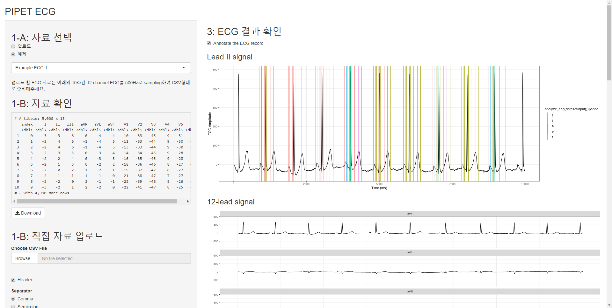
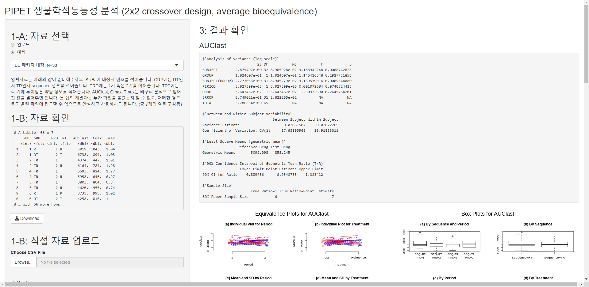
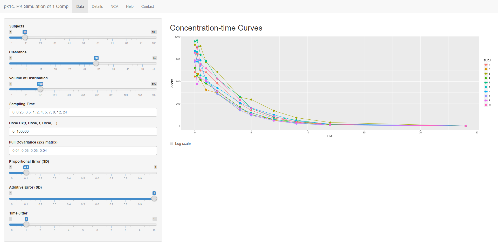
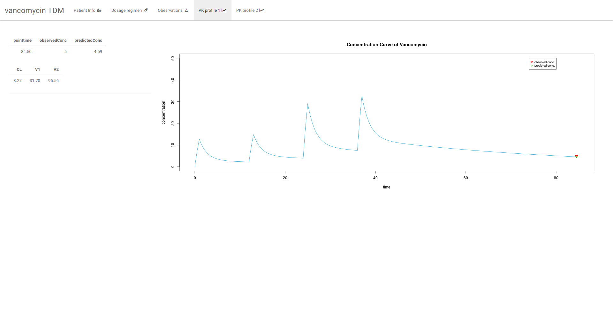

Column {data-width=200}
-------------------------------------

### Introduction

Welcome to [pipetapps.com](http://www.pipetapps.com). 

In PIPET (Pharmacometrics Institute for Practical Education & Training, 가톨릭대학교 계량약리학연구소), we are actively developing apps of pharmacometrics or clinical pharmacology. Here in pipetapps.com, we are compiling and curating part of developed apps.

You can use pipetapps for a wide variety of calculation and analysis for PK data or simulation of pharmacometrics models.

### Scopes

Column {.tabset}
-------------------------------------

### Apps (Images)

 | | 
---|---|---
  [PIPET ECG app : CiPA](./pipetecg)    |     [Bioequivalance app](./shiny-be)    |     [Tacrolimus TDM](https://asan.shinyapps.io/pk1c/) 
  [PK Simulation](https://asan.shinyapps.io/pk1c)  |   [TDM Vancomycin](https://pipet.shinyapps.io/vancomycin/)  |   [TDM Cyclosporin](URL) 
  [MCRM](URL) |  [Static DDI app](URL) |  [Caffeine PK simulation app](URL) 

### Apps (List)

- [PIPET ECG app : CiPA](./pipetecg)

- MCRM
- Static DDI app
- [Caffeine PK simulation app](./shiny-caffsim)

