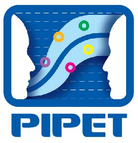

Column {data-width=200}
-------------------------------------

### Introduction


Welcome to [pipetapps.com](http://www.pipetapps.com). 

In PIPET (Pharmacometrics Institute for Practical Education & Training, 가톨릭대학교 계량약리학연구소), we are actively developing apps of pharmacometrics or clinical pharmacology. Here in pipetapps.com, we are compiling and curating part of developed apps.

You can use pipetapps for a wide variety of calculation and analysis for PK data or simulation of pharmacometrics models.

### Scopes


Column {.tabset}
-------------------------------------

### Apps (Images)

```{r include = FALSE}
get_link <- function(image_path = '', app_title = '', URL = '', github_path = 'none'){
  ifelse(github_path != 'none',
         sprintf('<br> [%s](%s) [](https://github.com/%s) <br>', 
                 image_path, app_title, URL, github_path, github_path),
         sprintf('<br> [%s](%s)', 
                 image_path, app_title, URL))
}

app_links <- list(
  shiny_caff = get_link("shiny-caff", "Caffeine PK simulation", 
                        "https://asan.shinyapps.io/caff", "asancpt/shiny-caff"),
  pk1c = get_link("pk1c", "PK Simulation - IV", 
                  "https://asan.shinyapps.io/pk1c", "pipetcpt/shiny-pk1c-iv"),
  tac = get_link("tac", "TDM Tacrolimus", 
                        "https://pipet.shinyapps.io/tacrolimus/", "pipetcpt/tdm-tacrolimus"),
  cyclo = get_link('cyclo', 'TDM Cyclosporin', 
                   "https://pipet.shinyapps.io/cyclosporin/", 'pipetcpt/tdm-cyclosporin'),
  vanco = get_link('vanco', 'TDM Vancomycin', 
                   "https://pipet.shinyapps.io/vancomycin/", 'pipetcpt/tdm-vancomycin'),
  mcrm = get_link('mcrm', 'Modified CRM', 
                  "https://pipet.shinyapps.io/mcrm/", "pipetcpt/shiny-mcrm"),
  ddi_static = get_link('ddi_static', 'Static DDI model', 
                  "https://mychloe00.shinyapps.io/ddi_static/", "none"),
  shiny_be = get_link("shiny-be", "Bioequivalance app", 
                      "./shiny-be", "pipetcpt/shiny-be"),
  pipetecg = get_link("pipetecg", "PIPET ECG app : CiPA",
                      "./pipetecg", "none")
)
```

| | 
---|---|---
`r app_links$pk1c` | `r app_links$shiny_be` | `r app_links$shiny_caff`
`r app_links$vanco` | `r app_links$tac` | `r app_links$cyclo`
`r app_links$mcrm` | `r app_links$ddi_static` | `r app_links$pipetecg`

### Apps (List)

