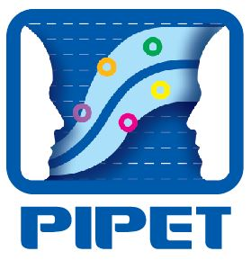
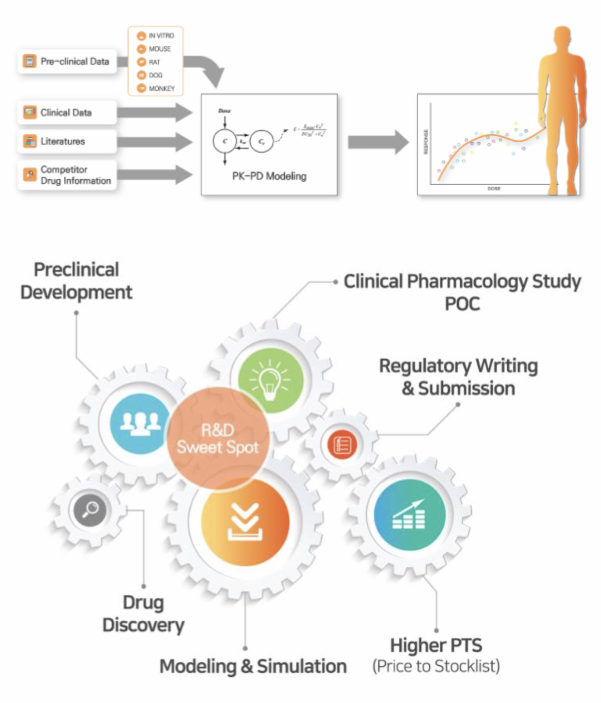

# Introduction 

- `pipetcpt` : open source softwares
- `pipetpro` : private repositories

## 4 Task Forces (소위원회)

**`pipetpro` only**

- [HRM](https://github.com/pipetpro/HRM-meeting)
- [CTC](https://github.com/pipetpro/CTC-meeting) 
- [SWD](https://github.com/pipetpro/SWD-meeting) 
- [RQC](https://github.com/pipetpro/RQC-meeting) 

## Members

`2019-04-08`

**THe members of PIPET** (Alphabetical orders)

1. [`crckhm`](https://github.com/crckhm) 김혜민 CK
1. [`dlaqudgml2`](https://github.com/dlaqudgml2) 임병희 PB
1. [`eheh9191`](https://github.com/eheh9191) 박은희 AA
1. [`oceanofscience`](https://github.com/oceanofscience) 임동석 FY
1. [`parkseeh`](https://github.com/parkseeh) 박시현 PP
1. [`pipetpro`](https://github.com/pipetpro) PIPET Pro
1. [`QJeon`](https://github.com/QJeon) 전상일 QJ
1. [`Seunghoon-Han`](https://github.com/Seunghoon-Han) 한승훈 FH
1. [`shanmdphd`](https://github.com/shanmdphd) 한성필 FP
1. [`Sojinee`](https://github.com/Sojinee) 이소진 GL
1. [`SOOYOUNG-KANG`](https://github.com/SOOYOUNG-KANG) 강수영 QS
1. [`Sueinchoi`](https://github.com/Sueinchoi) 최수인 RS

## Memorandum

**서울성모병원 임상약리과 - 가톨릭대학교 계량약리학연구소 (PIPET)**

### Trainee

1. 모르는 것을 끝까지 파고드는 호기심이 명문대 졸업장을 이긴다. (졸업장, 면허증 하나로 편히 살려는 사람 사절)
2. 학문에 있어서는 계급장 떼고 토론하라. (上命下服과 science는 함께할 수 없다.)
3. 모르는 것은 모른다고 말하라. (모름을 숨기면 배울 기회를 차버리는 것이다.)
4. 배우고 난 후 생각하고 질문하지 않는다면 배운 것이 아니다. (남이 지식을 전달해 줄 수 있어도 생각까지 대신해 줄 수는 없다.)
5. 사람의 품성은 아랫사람을 대하는 태도에서 거짓없이 드러난다. (위만 쳐다보지 말고 주변이 함께 일하고 싶은 사람이 되기를)

### Faculty

1. 속도보다 방향이다.
2. 윗사람에게 무조건 순종하거나 비위 맞추는 사람을 교수로 들이지 말라. (아래에도 같은 것을 요구하여 대학을 망친다.)
3. 각광받지 못하는 주제라도 깊이 파고들 수 있는 기개를 지녀라.
4. 배우는 사람의 잠재력을 최대한 끌어내는 것이 수련이다. (일을 시키는 것은 수련의 방법이지 목적이 아니다.)
5. 이 메모를 존중하는 것도, 휴지조각으로 만드는 것도 교수들에게 달려있다. (지키기 싫은 교수는 떠나라.)

2018.12  
임동석 (Director, PIPET)

## What we do

## Open-source simulation software

1. [CRM_simulation: Early clinical trial designing using CRM](https://www.edison.re.kr/search?p_p_id=edisonscienceAppstore_WAR_edisonappstore2016portlet&p_p_mode=view&p_p_state=maximized&_edisonscienceAppstore_WAR_edisonappstore2016portlet_solverId=85901)
1. [Intravenous_HBIG: 정맥 주사용 B형 간염 항체 용법용량 별 목표 농도 도달률 예측](https://www.edison.re.kr/search?p_p_id=edisonscienceAppstore_WAR_edisonappstore2016portlet&p_p_mode=view&p_p_state=maximized&_edisonscienceAppstore_WAR_edisonappstore2016portlet_solverId=85701)
1. [AntihypertensiveDrugs: Anti-Hypertensive Drugs 계산 프로그램](https://www.edison.re.kr/search?p_p_id=edisonscienceAppstore_WAR_edisonappstore2016portlet&p_p_mode=view&p_p_state=maximized&_edisonscienceAppstore_WAR_edisonappstore2016portlet_solverId=85501)
1. [TMDD_GC1118: TMDD_PK/Receptor Occupancy- GC1118](https://www.edison.re.kr/search?p_p_id=edisonscienceAppstore_WAR_edisonappstore2016portlet&p_p_mode=view&p_p_state=maximized&_edisonscienceAppstore_WAR_edisonappstore2016portlet_solverId=73101)
1. [PKsimIV: PK simulator IV Ver.](https://www.edison.re.kr/search?p_p_id=edisonscienceAppstore_WAR_edisonappstore2016portlet&p_p_mode=view&p_p_state=maximized&_edisonscienceAppstore_WAR_edisonappstore2016portlet_solverId=68701)
1. [PKsimEV: PK Simulator Extravascular Ver.](https://www.edison.re.kr/search?p_p_id=edisonscienceAppstore_WAR_edisonappstore2016portlet&p_p_mode=view&p_p_state=maximized&_edisonscienceAppstore_WAR_edisonappstore2016portlet_solverId=67601)

PIPET Papers (2017-Present)
===========================

\[1\] S. H. Bae, D. Yim, H. Lee, et al. “Application of Pharmacometrics in Pharmacotherapy: Open-Source Software for Vancomycin Therapeutic Drug Management”. In: *Pharmaceutics* 11.5 (May. 2019), p. 224. DOI: 10.3390/pharmaceutics11050224. &lt;URL: <https://doi.org/10.3390/pharmaceutics11050224>&gt;.

\[2\] S. Cho, S. Han, J. Ghim, et al. “A Randomized, Double-Blind Trial Comparing the Pharmacokinetics of CT-P16, a Candidate Bevacizumab Biosimilar, with its Reference Product in Healthy Adult Males”. In: *BioDrugs* 33.2 (Mar. 2019), pp. 173-181. DOI: 10.1007/s40259-019-00340-x. &lt;URL: <https://doi.org/10.1007/s40259-019-00340-x>&gt;.

\[3\] S. Choi, S. Han, S. Jeon, et al. “Quantitative Prediction of Human Pharmacokinetics and Pharmacodynamics of CKD519, a Potent Inhibitor of Cholesteryl Ester Transfer Protein (CETP)”. In: *Pharmaceutics* 11.7 (Jul. 2019), p. 336. DOI: 10.3390/pharmaceutics11070336. &lt;URL: <https://doi.org/10.3390/pharmaceutics11070336>&gt;.

\[4\] S. Han, S. Han, K. Kim, et al. “Usefulness of Bnet, a Simple Linear Metric in Discerning Torsades De Pointes Risks in 28 CiPA Drugs”. In: *Frontiers in Pharmacology* 10 (Nov. 2019). DOI: 10.3389/fphar.2019.01419. &lt;URL: <https://doi.org/10.3389/fphar.2019.01419>&gt;.

\[5\] T. M. Polasek, A. Rostami-Hodjegan, D. Yim, et al. “What Does it Take to Make Model-Informed Precision Dosing Common Practice? Report from the 1st Asian Symposium on Precision Dosing”. In: *The AAPS Journal* 21.2 (Jan. 2019). DOI: 10.1208/s12248-018-0286-6. &lt;URL: <https://doi.org/10.1208/s12248-018-0286-6>&gt;.

\[6\] S. H. Bae, W. Park, S. Han, et al. “Physiologically-based pharmacokinetic predictions of intestinal BCRP-mediated drug interactions of rosuvastatin in Koreans”. In: *The Korean Journal of Physiology & Pharmacology* 22.3 (2018), p. 321. DOI: 10.4196/kjpp.2018.22.3.321. &lt;URL: <https://doi.org/10.4196/kjpp.2018.22.3.321>&gt;.

\[7\] S. Choi, S. Jeon, and S. Han. “Population pharmacokinetic analysis of metformin administered as fixed-dose combination in Korean healthy adults”. In: *Translational and Clinical Pharmacology* 26.1 (2018), p. 25. DOI: 10.12793/tcp.2018.26.1.25. &lt;URL: <https://doi.org/10.12793/tcp.2018.26.1.25>&gt;.

\[8\] S. Han, B. Lim, H. Lee, et al. “Development of a user-friendly training software for pharmacokinetic concepts and models”. In: *Translational and Clinical Pharmacology* 26.4 (2018), p. 166. DOI: 10.12793/tcp.2018.26.4.166. &lt;URL: <https://doi.org/10.12793/tcp.2018.26.4.166>&gt;.

\[9\] D. Yim. “Five years of the CiPA project (20132018): what did we learn?” In: *Translational and Clinical Pharmacology* 26.4 (2018), p. 145. DOI: 10.12793/tcp.2018.26.4.145. &lt;URL: <https://doi.org/10.12793/tcp.2018.26.4.145>&gt;.

\[10\] S. Han, G. H. Na, and D. Kim. “A 6-month mixed-effect pharmacokinetic model for post-transplant intravenous anti-hepatitis B immunoglobulin prophylaxis”. In: *Drug Design, Development and Therapy* Volume 11 (Jul. 2017), pp. 2099-2107. DOI: 10.2147/dddt.s134711. &lt;URL: <https://doi.org/10.2147/dddt.s134711>&gt;.

\[11\] W. Huh, H. Oh, J. S. Han, et al. “Hydrochlorothiazide does not increase furosemide's effects in end-stage renal disease”. In: *Translational and Clinical Pharmacology* 25.1 (2017), p. 28. DOI: 10.12793/tcp.2017.25.1.28. &lt;URL: <https://doi.org/10.12793/tcp.2017.25.1.28>&gt;.

\[12\] D. Jang, S. Han, and D. Yim. “Development of an automated appendix generation system (ARGUS) for clinical study reports”. In: *Translational and Clinical Pharmacology* 25.1 (2017), p. 34. DOI: 10.12793/tcp.2017.25.1.34. &lt;URL: <https://doi.org/10.12793/tcp.2017.25.1.34>&gt;.

\[13\] G. Park, S. H. Bae, W. Park, et al. “Drug&ndash$\\mathsemicolon$drug interaction of microdose and regular-dose omeprazole with a CYP2C19 inhibitor and inducer”. In: *Drug Design, Development and Therapy* Volume11 (Mar. 2017), pp. 1043-1053. DOI: 10.2147/dddt.s131797. &lt;URL: <https://doi.org/10.2147/dddt.s131797>&gt;.

\[14\] W. Park, G. Park, S. Han, et al. “Human microdosing and mice xenograft data of AGM-130 applied to estimate efficacious doses in patients”. In: *Cancer Chemotherapy and Pharmacology* 80.2 (Jun. 2017), pp. 363-369. DOI: 10.1007/s00280-017-3373-y. &lt;URL: <https://doi.org/10.1007/s00280-017-3373-y>&gt;.

\[15\] N. Rajasekaran, H. S. Jung, S. H. Bae, et al. “Effect of HPV E6/E7 siRNA with Chemotherapeutic Agents on the Regulation of TP53/E2F Dynamic Behavior for Cell Fate Decisions”. In: *Neoplasia* 19.10 (Oct. 2017), pp. 735-749. DOI: 10.1016/j.neo.2017.07.005. &lt;URL: <https://doi.org/10.1016/j.neo.2017.07.005>&gt;.

\[16\] D. Yim. “Tutorial for beginners: the concept of clearance explained using the example of a vacuum cleaner”. In: *Translational and Clinical Pharmacology* 25.1 (2017), p. 1. DOI: 10.12793/tcp.2017.25.1.1. &lt;URL: <https://doi.org/10.12793/tcp.2017.25.1.1>&gt;.
